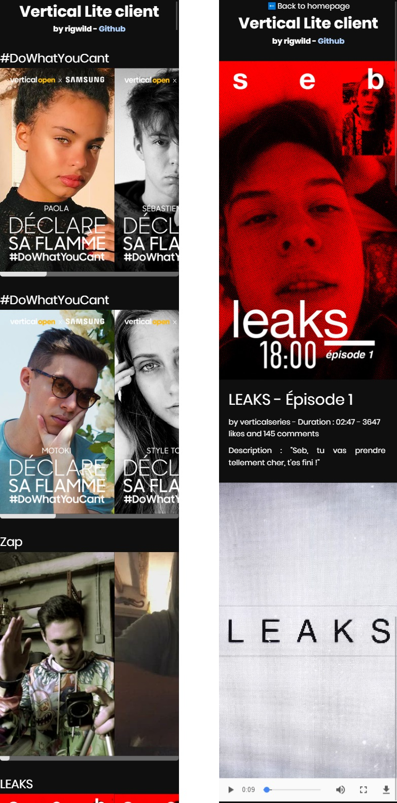
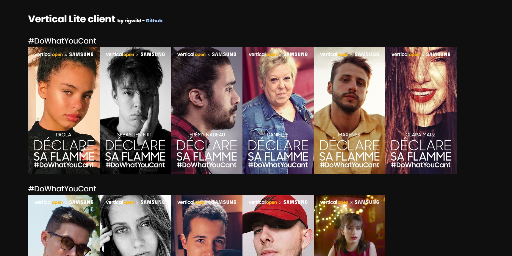
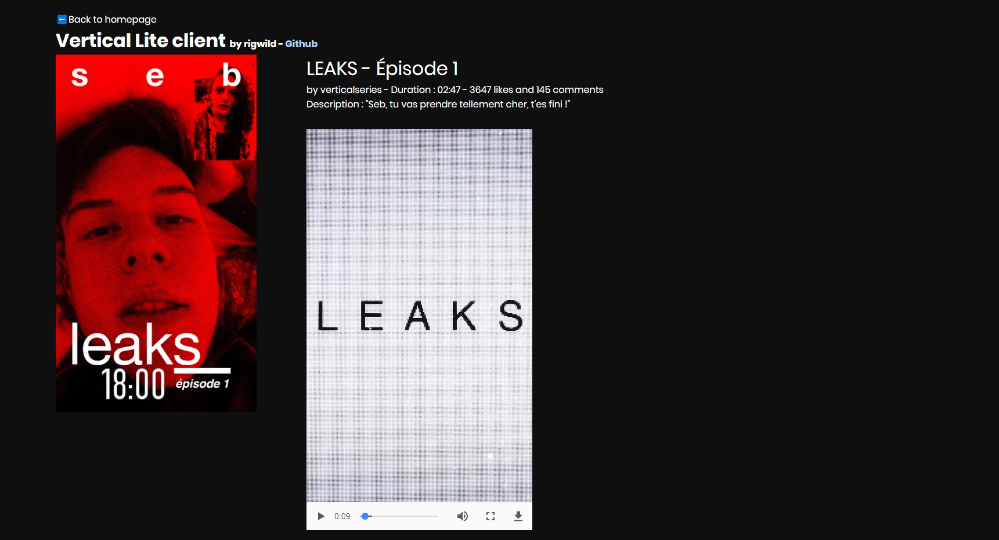

# appVertical-lite-client-PHP

##  IMPORTANT NOTICE
**App Vertical closed its service. This no longer works. This repo will be updated if the service open again.** 

This is a web lite client for the french application "**Vertical**". It's a service which provide application exclusive videos. I sniffed packets coming in and out of the application to understand how the API works and how to replicate the application requests.
This means that you don't need to download the application and you can watch their videos on your computer or mobile phone. It's responsive.
Nothing is hosted on your web server, you just retrieve data remotely from Vertical servers.

I will probably add the homepage cache soon (Save links to not reload everytime).

You can find a full Javascript version here : [https://github.com/rigwild/appVertical-lite-client-JS](https://github.com/rigwild/appVertical-lite-client-JS)

## Configuration
Upload all files on a webserver with **PHP** and **php-curl** installed. *I only tested it on PHP 7.2 though.*
Just run these commands to install everything you need :

	sudo add-apt-repository ppa:ondrej/php-7.0
	sudo apt-get update && apt-get upgrade
	sudo apt-get install php7.0-cli php7.0-common libapache2-mod-php7.0 php7.0 php7.0-mysql php7.0-fpm php7.0-curl php7.0-gd php7.0-bz2
    	sudo apt-get install php7.0-curl

Change login details in **functions.php** (A test account is already there, don't change it's password please !).

    /*Login details to change.*/
    $username = "testazerty";
    $password = "testazerty";

## Demo
~~You can test it live here~~ : **App Vertical closed its service.**

## Screenshots
Mobile view :

Computer view :

